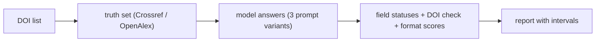
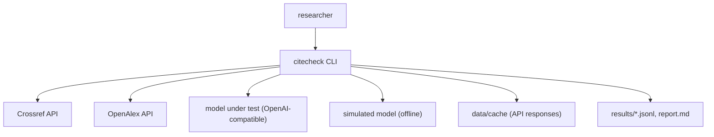
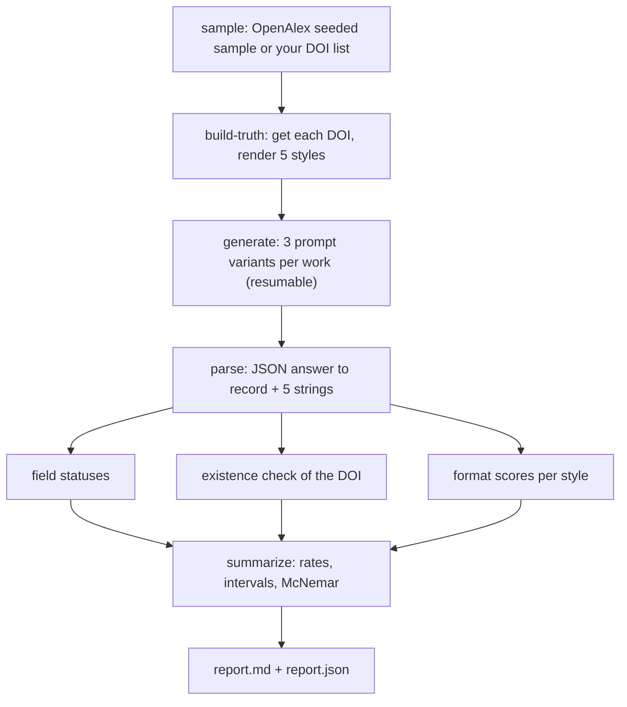

<div align="center">

# citecheck — Field-Level Accuracy Of LLM References In Five Styles

**citecheck is a benchmark tool that measures how accurately a language model writes academic references. It takes a seeded DOI sample through these steps to per-field hallucination rates with confidence intervals:**

`sample DOIs` → `build truth` → `generate` → `evaluate` → `report`.


**[Summary](#1-summary)** ·
**[Workflow](#4-the-end-to-end-workflow)** ·
**[Run it](#10-how-to-run-citecheck)** ·
**[Configuration](#104-environment-variables)** ·
**[Known problems](#13-known-problems)** ·
**[Glossary](#15-glossary)**

</div>

> [!NOTE]
> This README uses ASD-STE100 Simplified Technical English. The writing rules and the project
> vocabulary are in [`docs/ste-style-guide.md`](docs/ste-style-guide.md). Each term in the
> [Glossary](#15-glossary) has only one meaning.

---

citecheck asks a model for the bibliographic fields and the five reference strings of a work. It compares each field with DOI-resolved metadata from Crossref or OpenAlex. A false value is a hallucination. A missing value is an omission. citecheck counts the two apart and checks if a given DOI points to the same work. Paired tests compare prompt variants on the same works.

This README is the **one location that explains all of citecheck**. It gives these topics:

- the general design
- each component and its procedure, step by step
- the decision rules
- the data map
- the runbook
- the validation results and the known problems

| If you are… | Read |
|---|---|
| A manager or reviewer | [1](#1-summary), [3](#3-design-rules), [4](#4-the-end-to-end-workflow), [12](#12-validation-results), [14](#14-key-points) |
| A developer who joins the project | All sections, in sequence. Keep [10](#10-how-to-run-citecheck) and [13](#13-known-problems) open while you work |
| An operator who runs citecheck | [10](#10-how-to-run-citecheck), then the section for the component that you use |

---

## Table of contents

1. 🧭 [Summary](#1-summary)
2. 🏗️ [How citecheck is built](#2-how-citecheck-is-built)
   - 2.1 [Components](#21-components)
   - 2.2 [System context](#22-system-context)
   - 2.3 [Repository layout](#23-repository-layout)
3. 🛡️ [Design rules](#3-design-rules)
4. 🔄 [The end-to-end workflow](#4-the-end-to-end-workflow)
   - 4.1 [Full flow](#41-full-flow)
   - 4.2 [The life cycle of one work](#42-the-life-cycle-of-one-work)
5. 🔵 [Truth set and renderer](#5-truth-set-and-renderer)
6. 🟢 [Prompt variants and models](#6-prompt-variants-and-models)
7. 🟣 [Evaluation](#7-evaluation)
8. ⚖️ [The scoring and statistics rules](#8-the-scoring-and-statistics-rules)
9. 🗂️ [Data and file map](#9-data-and-file-map)
10. ▶️ [How to run citecheck](#10-how-to-run-citecheck)
    - 10.1 [Prerequisites](#101-prerequisites) · 10.2 [Installation](#102-installation) · 10.3 [Run citecheck](#103-run-citecheck) · 10.4 [Environment variables](#104-environment-variables)
11. 🧩 [How to extend citecheck](#11-how-to-extend-citecheck)
12. ✅ [Validation results](#12-validation-results)
13. ⚠️ [Known problems](#13-known-problems)
14. 📌 [Key points](#14-key-points)
15. 📖 [Glossary](#15-glossary)
16. 📄 [License](#16-license)

---

## 1. Summary

**The problem.** A whole-string similarity between two references mixes two different failures: a false fact and a different punctuation. The difficult questions are:

- Which fields does the model make up, and which fields does it leave out?
- Does a DOI from the model point to the work, to another work or to nothing?
- How much does the answer improve when the prompt gives the DOI or the full metadata?
- Is a difference between two prompts larger than chance on the same works?

citecheck gives each question its own metric and a paired test.

| Item | Value |
|---|---|
| Input | A CSV file of DOIs (`doi` column), or a seeded OpenAlex sample |
| Output | `truth.jsonl`, `generations.jsonl`, `eval.jsonl`, `report.md` and `report.json` |
| Components | **6**: sources, renderer, prompts and models, parser, metrics, statistics |
| Providers | Crossref and OpenAlex (truth), any OpenAI-compatible endpoint (model under test) |
| Offline mode | Synthetic records, the fixture source and the seeded simulated model |
| Safety | Keys come from the environment only. A test scans the repository for key patterns |
| Tests | **29** unit tests (`pytest`), all offline |



---

## 2. How citecheck is built

### 2.1 Components

| Component | Module | Purpose |
|---|---|---|
| Records | `src/citecheck/records.py` | `WorkRecord` schema (CSL-like fields), loose-input cleaning |
| Normalisation | `src/citecheck/normalize.py` | Title, DOI, name and page folding, token F1 |
| Sources | `src/citecheck/sources/` | Crossref and OpenAlex parsers, cached HTTP client, fixture source |
| Renderer | `src/citecheck/render.py` | Reference strings for the five styles, looked up by name |
| Prompts | `src/citecheck/prompts.py` | The three prompt variants and the JSON answer contract |
| Models | `src/citecheck/llm.py` | OpenAI-compatible client, simulated model, scripted model |
| Parser | `src/citecheck/parse.py` | JSON extraction and record building from an answer |
| Metrics | `src/citecheck/metrics.py` | Field statuses, author scores, existence check, format scores |
| Statistics | `src/citecheck/stats.py` | Bootstrap intervals, paired bootstrap, exact McNemar test |
| Pipeline | `src/citecheck/pipeline.py` | Truth, generation (resumable), evaluation, summary |
| Report | `src/citecheck/report.py` | Markdown report, with a banner for simulated results |
| Synthetic data | `src/citecheck/synthetic.py` | Invented records with test-prefix DOIs |
| CLI | `src/citecheck/cli.py` | The `citecheck` command |

### 2.2 System context



### 2.3 Repository layout

```
citecheck/
├── data/README.md            sources, terms, file schema (no data is committed)
├── docs/ste-style-guide.md   writing rules and project vocabulary
├── src/citecheck/
│   ├── records.py normalize.py render.py prompts.py
│   ├── llm.py parse.py metrics.py stats.py
│   ├── pipeline.py report.py synthetic.py config.py
│   ├── sources/              http.py (cache, rate, retry), apis.py (Crossref, OpenAlex, fixture)
│   └── cli.py                the citecheck command
├── tests/                    pytest suite (offline)
└── pyproject.toml            package and the console script
```

---

## 3. Design rules

### 3.1 Truth from open APIs, not from scraping
The truth set comes from Crossref or OpenAlex by DOI. The renderer makes the five reference strings from these records. citecheck never scrapes a search engine.

### 3.2 Styles by name
`render.STYLES` maps each style name to its renderer. No code maps a style to a row position, so APA and MLA can never change places. A test checks a typical pattern of each style.

### 3.3 Field-level scoring
Each field gets the status `correct`, `wrong`, `missing` or `n/a`. A wrong value is a hallucination. A missing value is an omission. The two rates are separate.

### 3.4 Real tests, not a test against 1.0
Every rate has a 95% bootstrap interval. Two prompt variants are compared on the same works with the exact McNemar test and a paired bootstrap interval.

### 3.5 No made-up results
A failed model call is saved with its error and an empty answer. The simulated model marks every row as `simulated`. `summarize` refuses a file that mixes simulated and real rows, and the report shows a banner for simulated results.

### 3.6 Keys from the environment only
The model key comes from `CITECHECK_LLM_API_KEY` or `OPENAI_API_KEY`. The settings object hides the key in its text form. A test scans all tracked files for key patterns.

### 3.7 Polite, repeatable data collection
The HTTP client caches each response on disk, waits `CITECHECK_MIN_INTERVAL_S` between calls and retries HTTP 429 and 5xx with back-off. An error stops the run. It never becomes an "N/A" row.

---

## 4. The end-to-end workflow

### 4.1 Full flow



### 4.2 The life cycle of one work

1. `sample` puts the DOI of the work in `data/dois.csv`.
2. `build-truth` gets the record from the source and renders the five reference strings.
3. `build-truth` skips the work if the source has no authors or no year for it.
4. `generate` sends three prompts: title only, title and DOI, full metadata.
5. The model returns one JSON object with the fields and five reference strings.
6. `parse_answer` reads the JSON object. A parse failure counts every field as missing.
7. `field_statuses` compares each field with the truth after normalisation.
8. `existence` gets the DOI of the answer from the source and compares the titles.
9. `format_scores` compares each reference string with the rendered truth.
10. `summarize` puts the work into the rates and the paired tests of each variant.

---

## 5. Truth set and renderer

**Purpose.** Make exact, repeatable ground truth for each work and each style.

| Input | Output |
|---|---|
| DOIs and a source (`crossref`, `openalex` or `fixture`) | `truth.jsonl`: `source`, `record`, `citations` |

**Procedure**

1. Normalise each DOI (remove `https://doi.org/` and `doi:`, fold case).
2. Get the record. A 404 answer means that the DOI does not exist.
3. Map the source type to `article-journal`, `paper-conference`, `book`, `chapter`, `report` or `other`.
4. Render the five reference strings.

**Rules of the renderer**

| Style | Authors | Pattern for a journal article |
|---|---|---|
| `apa` | `Family, I. I.`, `&` before the last, up to 20, then `. . .` and the last | `Authors (Year). Title. Journal, Volume(Issue), pages. https://doi.org/DOI` |
| `mla` | first `Family, Given`, two with `and`, three or more `et al.` | `Authors. “Title.” Journal, vol. V, no. I, Year, pp. P, https://doi.org/DOI.` |
| `chicago` | first inverted, others `Given Family`, up to 10 | `Authors. Year. “Title.” Journal Volume (Issue): pages. https://doi.org/DOI.` |
| `harvard` | `Family, I.I.`, `and` before the last, more than 3 `et al.` | `Authors (Year) ‘Title’, Journal, Volume(Issue), pp. pages. Available at: https://doi.org/DOI.` |
| `vancouver` | `Family II`, up to 6, then `et al.` | `Authors. Title. Journal. Year;Volume(Issue):pages. doi:DOI` |

The renderer follows the main pattern of each style guide. It is a simplified version, not a full CSL processor. Section 13 lists the limits.

---

## 6. Prompt variants and models

**Purpose.** Ask the model for the same facts with three amounts of input.

| Variant | The prompt gives |
|---|---|
| `title_only` | The title |
| `title_doi` | The title and the DOI |
| `full_metadata` | The title, the DOI, the authors, the year, the type, the container, the volume, the issue, the pages, the publisher |

The system prompt asks for one JSON object with `authors`, `year`, `title`, `container_title`, `volume`, `issue`, `pages`, `doi`, `type` and `citations` (one string for each style). It tells the model to leave unknown facts empty.

| Model | Module | Use |
|---|---|---|
| `OpenAICompatibleLLM` | `llm.py` | Real runs. Temperature 0, JSON mode, `https` base URL (or `localhost`) |
| `SimulatedLLM` | `llm.py` | Offline runs. Seeded errors with fixed rates for each variant. Every row is marked `simulated` |
| `ScriptedLLM` | `llm.py` | Tests. Fixed answers |

**Rules**

- Generation is resumable. A (work, variant, model) triple in the output file is not sent again.
- A failed call is saved with `error` and an empty `raw` field.

---

## 7. Evaluation

**Purpose.** Give each answer field statuses, a DOI result and format scores.

| Input | Output |
|---|---|
| `truth.jsonl`, `generations.jsonl`, a source | `eval.jsonl`: one row per answer |

**Procedure**

1. Read the first balanced JSON object of the answer. Ignore code fences and text around it.
2. Build a record. Drop unknown keys, invalid years and invalid DOIs.
3. Give each field a status (section 8).
4. Compute author precision, recall, F1 and first-author match on normalised family names.
5. Run the existence check on the DOI of the answer.
6. Compute exact match and token F1 for each of the five reference strings.

---

## 8. The scoring and statistics rules

**Field statuses.**

| Field | `correct` when |
|---|---|
| `authors` | The normalised family names are equal, in the same order |
| `year` | The years are equal |
| `title` | Token F1 of the normalised titles is at least 0.9 |
| `container_title` | Equal after folding, or token F1 at least 0.9 |
| `volume`, `issue` | Equal after folding |
| `pages` | Equal after normalisation (`123-9` becomes `123-129`) |
| `doi` | Equal after normalisation |

A field is `n/a` when the truth has no value. It is `missing` when the answer has no value. Otherwise it is `wrong`.

**Existence check.**

| Result | Meaning |
|---|---|
| `same_work` | The DOI equals the true DOI, or it points to a record with a title match |
| `other_work` | The DOI points to a real record of another work |
| `not_found` | The source does not know the DOI |
| `no_doi` | The answer has no DOI |

**Format scores.** Exact match folds case, quotes, dashes and spaces, but keeps punctuation, because punctuation is part of a style. Token F1 compares the words only. A high token F1 with a low exact match means correct facts in a wrong format.

**Statistics.** Each rate has a 95% percentile bootstrap interval (2000 resamples, seed 0). citecheck compares each prompt variant with `title_only` on the same works. It uses the exact McNemar test for each field and a paired bootstrap interval of the accuracy difference.

---

## 9. Data and file map

| Path | Committed? | Contents |
|---|---|---|
| `data/README.md` | Yes | Sources, terms and file schema |
| `data/dois.csv` | No (git ignores it) | The DOI sample |
| `data/cache/` | No (git ignores it) | API responses |
| `results/truth.jsonl` | No (git ignores it) | Truth set |
| `results/generations.jsonl` | No (git ignores it) | Model answers |
| `results/eval.jsonl` | No (git ignores it) | Evaluation rows |
| `results/report.md`, `report.json` | No (git ignores it) | Summary |
| `.env` | No (git ignores it) | Local settings and the key |
| `.env.example` | Yes | Names of the environment variables |

---

## 10. How to run citecheck

### 10.1 Prerequisites

| Need | For |
|---|---|
| Python 3.11+ | All components |
| Network access | `sample`, `build-truth` and `evaluate` with `crossref` or `openalex`, and real model runs |
| A key for an OpenAI-compatible endpoint | Real model runs only |

### 10.2 Installation

```bash
git clone https://github.com/KrishnaAnnavaram/citecheck.git
cd citecheck
python -m venv .venv
. .venv/bin/activate            # Windows: .venv\Scripts\activate
pip install -e ".[dev]"
```

### 10.3 Run citecheck

```bash
# offline demo: 60 synthetic works, the simulated model, all stages
citecheck demo

# real run (network): sample, truth, answers, evaluation, report
citecheck sample --source openalex --n 200 --seed 0 --out data/dois.csv
citecheck build-truth --source crossref --dois data/dois.csv --out results/truth.jsonl
citecheck generate --provider openai --truth results/truth.jsonl --out results/generations.jsonl
citecheck evaluate --source crossref --truth results/truth.jsonl --generations results/generations.jsonl --out results/eval.jsonl
citecheck report --eval results/eval.jsonl --out results/report.md

# show the five reference strings of one DOI
citecheck render 10.1038/nature14539 --source crossref
```

### 10.4 Environment variables

| Variable | Used by | Meaning |
|---|---|---|
| `CITECHECK_DATA_DIR` | CLI | Data folder. Default `data` |
| `CITECHECK_RESULTS_DIR` | CLI | Results folder. Default `results` |
| `CITECHECK_CACHE_DIR` | sources | API cache. Default `data/cache` |
| `CITECHECK_CONTACT_EMAIL` | sources | Sent as `mailto` to Crossref and OpenAlex (polite pool) |
| `CITECHECK_MIN_INTERVAL_S` | sources | Seconds between API calls. Default `0.2` |
| `CITECHECK_LLM_PROVIDER` | `generate` | `simulated` (default) or `openai` |
| `CITECHECK_LLM_BASE_URL` | `generate` | Default `https://api.openai.com/v1` |
| `CITECHECK_LLM_MODEL` | `generate` | Default `gpt-4o-mini` |
| `CITECHECK_LLM_API_KEY` | `generate` | Model key. `OPENAI_API_KEY` is also read |
| `CITECHECK_LLM_TIMEOUT_S` | `generate` | Default `60` |

Credentials are only in a local `.env` file. Git ignores this file. Do not print or commit credentials.

---

## 11. How to extend citecheck

| You want to… | Do this | Code change? |
|---|---|---|
| Test another model | Set `CITECHECK_LLM_BASE_URL` and `CITECHECK_LLM_MODEL`, then run `generate` again into a new file | No |
| Use your own DOI list | Write a CSV with a `doi` column and pass it to `build-truth` | No |
| Add a style | Add a renderer to `STYLES` in `render.py` and a test of its pattern | Small |
| Use official CSL styles | Replace the renderer with a CSL processor (for example `citeproc-py`) behind the same `render` function | Yes |
| Add a prompt variant | Add it to `VARIANTS` and to `user_prompt` | Small |
| Add a source | Write a class with `name` and `lookup_doi(doi)` | Small |

---

## 12. Validation results

| Validation | Result | Command |
|---|---|---|
| Unit tests | **29 passed** (all offline, the same in CI) | `pytest -q` |
| Pipeline check with the simulated model | See below | `citecheck demo --n 200` |

**Pipeline check (SIMULATED).** The simulated model has fixed error rates (`ERROR_RATES` in `llm.py`). A correct pipeline must find these rates again. With 200 synthetic works and seed 0, the `full_metadata` variant has a set year-error rate of 2%. The measured year accuracy is 96.5% [93.5%, 99.0%], with 2.0% hallucination and 1.5% omission. The `title_doi` variant has a set DOI-error rate of 5%. The measured DOI accuracy is 94.0% [90.5%, 97.0%], and the existence check finds the same work for 94.0% of answers.

| Prompt variant (simulated) | Year accuracy | DOI accuracy | DOI points to another real work | APA exact match | APA token F1 |
|---|---|---|---|---|---|
| `title_only` | 46.0% | 23.0% | 16.0% | 0.5% | 0.725 |
| `title_doi` | 50.5% | 94.0% | 0.0% | 4.5% | 0.840 |
| `full_metadata` | 96.5% | 99.5% | 0.0% | 65.0% | 0.988 |

These numbers describe the simulator, not a real model. They show that the statuses, the existence check, the intervals and the McNemar tests work together. No real-model result is in this repository. The prototype reported only `SequenceMatcher` similarities on a duplicated sample. Those numbers are not reproduced here.

---

## 13. Known problems

Read these problems before you publish a result from citecheck.

| # | Area | Problem | Impact and action |
|---|---|---|---|
| 1 | Results | No real-model result is in the repository or in CI | Run the real pipeline with your own key and report the model version and the date |
| 2 | Renderer | The renderer is a simplified version of each style. It has no italics, no editors, no conference locations, no title-case rules | Exact match can count a correct reference as different. Read token F1 and the field rates first |
| 3 | Truth | Crossref and OpenAlex metadata can be incomplete or wrong (for example a missing issue) | A field with no truth value is `n/a`. A wrong truth value counts against the model |
| 4 | Authors | OpenAlex gives display names, so the family name is the last word | Names such as "van der Berg" can split wrongly. Prefer Crossref for the truth set |
| 5 | Title match | A title match uses token F1 ≥ 0.9 | Two works with almost the same title can count as the same work |
| 6 | Scope | The sample filter is `type:article,has_doi:true` by default | Books and works without a DOI are not in the default sample |
| 7 | Prototype data | The earlier data from search-result pages is not used | Old and new numbers are not comparable |

---

## 14. Key points

1. **Hallucination and omission are different.** citecheck counts a false value and a missing value apart, for each field.
2. **A DOI must point to the same work.** The existence check separates a correct DOI, a real but different work and an invented DOI.
3. **Truth is exact and legal.** Open APIs by DOI, rendered by fixed rules, and no scraping.
4. **Comparisons are paired.** McNemar tests and bootstrap intervals on the same works, not a test against 1.0.
5. **Simulated numbers stay apart.** The pipeline refuses to mix them with real results and marks them in the report.

---

## 15. Glossary

| Term | Meaning |
|---|---|
| **work** | One publication that has a DOI |
| **record** | The bibliographic fields of one work |
| **field** | One part of a record, for example `year` or `doi` |
| **source** | The ground-truth service: `crossref`, `openalex` or `fixture` |
| **truth set** | The records and their reference strings in `truth.jsonl` |
| **style** | One reference format: `apa`, `mla`, `chicago`, `harvard`, `vancouver` |
| **reference string** | The text of one reference in one style |
| **prompt variant** | `title_only`, `title_doi` or `full_metadata` |
| **answer** | The raw text of the model for one work and one variant |
| **status** | `correct`, `wrong`, `missing` or `n/a` for one field |
| **hallucination** | A field with a false value |
| **omission** | A field with no value although the truth has one |
| **existence check** | The result for the DOI of an answer: `same_work`, `other_work`, `not_found`, `no_doi` |
| **token F1** | The F1 score of the word tokens of two strings |
| **simulated model** | The seeded error model for offline runs |

---

## 16. License

[MIT](LICENSE) © 2026 Krishna Annavaram
